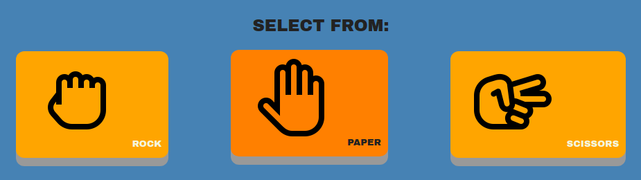

# Rock, Paper, Scissors

A webpage where you can play rock, paper, scissors against a computer. Project completed for The Odin Project [curriculum](https://www.theodinproject.com/lessons/foundations-rock-paper-scissors).

My **live demo** can be found [here](https://latsonj.github.io/rock-paper-scissors/). This project was created to be played in a browser console, then revisited by making a UI. 

## Technologies used

 - **HTML5**
 - **CSS3**
 - **Vanilla JS**

## Screenshots

  

## Learning Observations

This project was the first project to put the *focal point* on JavaScript, challenging learners to write clean code that functioned well.

Rock, paper, scissors familiarized me with **writing functions**, **pseudo-code** and **debugging**.

Making the console version helped me to learn basic **loops** and **conditionals** while utilizing **Math functions** plus **conditional & numerical** operators. It also introduced me to **prompts** and a variety of **string methods**. Making the UI focused more on **event listeners** and **manipulating the DOM**. 

I struggled with the **bubbling** behavior of events; I had included images inside all my buttons and was confused as to why the events weren't firing properly. Fortunately, I found a solution by looking at the warnings and running through my code and fixed the event target code. 

I found both parts very helpful, had to **refactor** some code and was able to build a solid understanding of the basics of JavaScript.

Overall, this was a very fun project to make and the CSS aspect was very satisfying to work through.

## Attributions

This project was created using images from:

- [Reload icons created by Uniconlabs - Flaticon](https://www.flaticon.com/free-icons/reload)
- [Rock paper scissors icons created by Freepik - Flaticon](https://www.flaticon.com/free-icons/rock-paper-scissors)
- [Rock paper scissors icons created by Cap Cool - Flaticon](https://www.flaticon.com/free-icons/rock-paper-scissors)
- [Closed fist icons created by Cap Cool - Flaticon](https://www.flaticon.com/free-icons/closed-fist)
- [On hold icons created by Cap Cool - Flaticon](https://www.flaticon.com/free-icons/on-hold)

## Author

Created by [latsonj](https://github.com/latsonj)